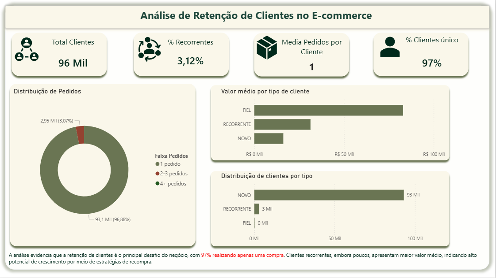

#  Análise de Retenção de Clientes — E-commerce

---

##  Visão de Negócio

Este projeto simula a atuação de um Analista de BI em um ambiente de produto digital, com foco em:

- Retenção de clientes  
- Análise de comportamento de compra  
- Identificação de alavancas de crescimento  
- Proposição de estratégias baseadas em dados  

A retenção é um dos principais drivers de crescimento sustentável em e-commerce, impactando diretamente receita e LTV (Lifetime Value).

---

##  Problema de Negócio

A aquisição de clientes é cara. Portanto, o crescimento sustentável depende da capacidade de reter usuários.

Diante disso, surgem as seguintes perguntas:

- Os clientes retornam após a primeira compra?  
- Qual o nível de retenção da base?  
- Clientes recorrentes geram mais valor?  
- Onde está a principal oportunidade de crescimento?  

---

##  Objetivo

- Medir o nível de retenção de clientes  
- Identificar padrões de recompra  
- Avaliar o valor gerado por clientes recorrentes  
- Gerar recomendações para aumento de retenção  

---

##  Principais Métricas

- % Clientes recorrentes  
- % Clientes únicos  
- Média de pedidos por cliente  
- Valor médio por tipo de cliente  

---

##  Dataset

- Brazilian E-Commerce Public Dataset (Olist)  
- Dados reais de pedidos, clientes e transações  

---

##  Tecnologias Utilizadas

- SQL (extração e transformação de dados)  
- Power BI (visualização e análise)  

---

## Metodologia

- Agregação de pedidos por cliente  
- Classificação de clientes por comportamento (novo, recorrente, fiel)  
- Análise de frequência de compra  
- Avaliação de valor médio por tipo de cliente  

---

## Resultados

- Total de clientes: ~96 mil  
- % Clientes únicos: **97%**  
- % Clientes recorrentes: **3,12%**  
- Média de pedidos por cliente: **1**  

---

##  Principais Insights

- A base de clientes apresenta **baixa retenção crítica**  
- A maioria dos usuários realiza apenas **uma única compra**  
- Clientes recorrentes, apesar de poucos, possuem **maior valor médio**  
- O modelo atual depende fortemente de aquisição  

---

#  Hipóteses de Negócio

1. A experiência inicial do cliente impacta diretamente a recompra  
2. Falta de incentivo reduz a recorrência  
3. Problemas logísticos podem afetar o retorno do cliente  
4. Ausência de personalização reduz engajamento  

---

#  Propostas de Experimentação

###  Experimento 1 — Incentivo à Recompra

- Oferecer cupom após primeira compra  
- Medir impacto em:
  - Taxa de recompra  
  - Tempo entre pedidos  

---

###  Experimento 2 — Experiência Inicial

- Melhorar prazo de entrega para novos clientes  
- Avaliar impacto em retenção  

---

###  Experimento 3 — Personalização

- Recomendação de produtos baseada no histórico  
- Testar aumento de conversão e recorrência  

---

#  Métricas de Sucesso

- Taxa de retenção  
- Frequência de compra  
- LTV (Lifetime Value)  
- Receita por cliente  

---

## 📈 Impacto no Negócio

A melhoria da retenção pode gerar:

- Aumento significativo de receita  
- Redução de custo de aquisição (CAC)  
- Crescimento sustentável  
- Maior previsibilidade de receita  

 Pequenos aumentos na retenção podem gerar grande impacto financeiro

---

##  Recomendação Estratégica

- Priorizar retenção como KPI principal  
- Investir na jornada do primeiro pedido  
- Criar estratégias de engajamento pós-compra  
- Implementar cultura de experimentação contínua  

---

## Dashboard

O dashboard permite visualizar:

- Distribuição de clientes  
- Frequência de compra  
- Segmentação por comportamento  
- Valor médio por tipo de cliente  

---

## Diferenciais do Projeto

- Foco em retenção (métrica crítica de negócio)  
- Análise orientada a crescimento  
- Proposição de experimentos  
- Storytelling estratégico  
- Estrutura alinhada com times de produto  

---

## Próximos Passos

- Análise de cohort (retenção ao longo do tempo)  
- Modelagem de churn  
- Segmentação avançada de clientes  
- Previsão de comportamento de recompra  

---

## 👨‍💻 Autor

**Weslley Marques**  
LinkedIn: https://www.linkedin.com/in/weslley-marques-86a28937b
